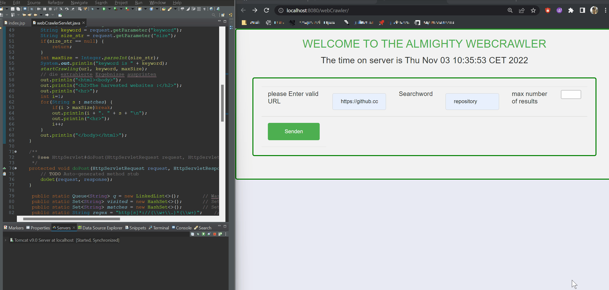

# Webcrawler implementaion in Java + JSP

This is a basic implementation of a webcrawler employing [Breadth First Search](https://en.wikipedia.org/wiki/Breadth-first_search) algorithm. The crawler is implemented in Java and the web interface is implemented in JSP.




## Dependencies

- [Jsoup 1.9.2](https://jsoup.org/download) - Java HTML Parser
- [Java Servlet API 3.1](https://mvnrepository.com/artifact/javax.servlet/javax.servlet-api/3.1.0) - Java Servlet API
- [Java SE 11](https://www.oracle.com/java/technologies/javase-jdk11-downloads.html) - Java Development Kit 11
- [Apache Tomcat 9.0.31](https://tomcat.apache.org/download-90.cgi) - Java Web Server for local development

## Usage

Clone the repository

```bash	
git clone https://github.com/amrohendawi/java-jsp-webcrawler
```

Import the project into your IDE of choice. I used [Eclipse IDE for Java EE Developers](https://www.eclipse.org/downloads/packages/release/2019-12/r/eclipse-ide-java-ee-developers) for this project.

Install and configure the dependencies.

Run the project on your local server. I used [Apache Tomcat 9.0.31](https://tomcat.apache.org/download-90.cgi) for this project.

## License
[MIT](https://choosealicense.com/licenses/mit/)

## Contributing
Pull requests are welcome. For major changes, please open an issue first to discuss what you would like to change.

Please make sure to update tests as appropriate.


**Implementation date**: 2019-12-01